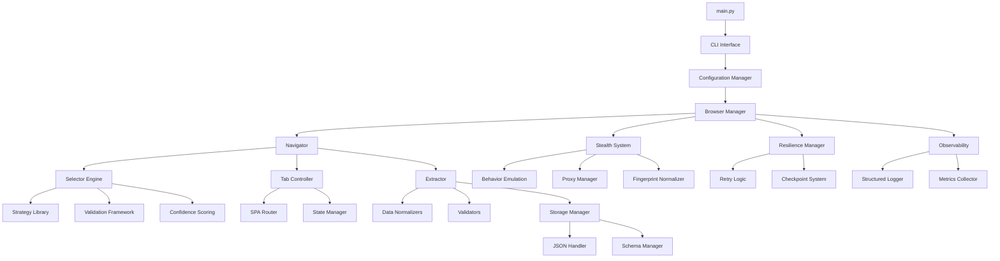
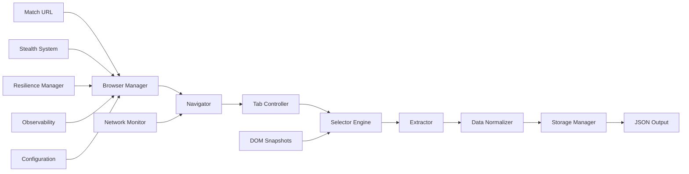

# Scorewise Scraper - Features List

## �️ Project Structure

### Directory Layout

```text
scorewise-scraper/
├── README.md                           # Project overview and quick start
├── ARCHITECTURE.md                     # System design and module relationships
├── DEPLOYMENT.md                       # Production deployment guide
├── TROUBLESHOOTING.md                  # Common issues and solutions
├── requirements.txt                    # Python dependencies
├── config.yaml                         # Default configuration
├── main.py                            # Entry point and CLI interface
│
├── src/                               # Source code root
│   ├── __init__.py
│   ├── core/                          # Core scraper components
│   │   ├── __init__.py
│   │   ├── browser_manager.py         # Browser lifecycle authority (creation, disposal, restart)
│   │   ├── navigator.py              # Main browser navigation controller
│   │   ├── tab_controller.py         # UI tab interaction manager
│   │   └── extractor.py              # Data extraction engine
│   │
│   ├── selectors/                     # 🔥 SELECTOR ENGINE (System Backbone)
│   │   ├── __init__.py
│   │   ├── engine.py                 # Main selector resolution engine
│   │   ├── registry.py               # Semantic selector definitions
│   │   ├── strategies/               # Multi-strategy resolution approaches
│   │   │   ├── __init__.py
│   │   │   ├── text_anchor.py        # Text-based selector strategy
│   │   │   ├── attribute_match.py    # Attribute-based selector strategy
│   │   │   ├── dom_relationship.py   # DOM relationship strategy
│   │   │   └── role_based.py         # Role/semantic attribute strategy
│   │   ├── validation.py             # Content validation framework
│   │   ├── confidence.py             # Confidence scoring system
│   │   ├── drift_detection.py        # Pattern recognition for changes
│   │   └── adaptation.py             # Strategy evolution logic
│   │
│   ├── stealth/                       # 🛡️ STEALTH & ANTI-DETECTION
│   │   ├── __init__.py
│   │   ├── fingerprint.py            # Browser fingerprint normalization
│   │   ├── behavior.py               # Human behavior emulation
│   │   ├── proxy_manager.py          # IP rotation and session management
│   │   ├── consent_handler.py        # GDPR/cookie consent management
│   │   └── anti_detection.py         # Bot signal masking
│   │
│   ├── navigation/                    # 🧭 NAVIGATION & ROUTING
│   │   ├── __init__.py
│   │   ├── spa_router.py             # Client-side routing awareness
│   │   ├── state_manager.py          # DOM readiness detection
│   │   ├── retry_logic.py            # Soft-failure recovery
│   │   └── tab_intelligence.py       # Tab availability and control
│   │
│   ├── extraction/                    # 📊 DATA EXTRACTION & NORMALIZATION
│   │   ├── __init__.py
│   │   ├── match_header.py           # Teams, scores, status extraction
│   │   ├── statistics.py              # Match statistics parsing
│   │   ├── lineups.py                # Team composition data
│   │   ├── odds.py                   # Betting markets extraction
│   │   ├── h2h.py                    # Head-to-head history
│   │   ├── standings.py              # League rankings
│   │   ├── normalizers/              # Domain-specific data normalization
│   │   │   ├── __init__.py
│   │   │   ├── time_parser.py        # Temporal data normalization
│   │   │   ├── odds_parser.py        # Betting odds normalization
│   │   │   └── score_parser.py       # Score data normalization
│   │   └── validators.py             # Data quality validation
│   │
│   ├── resilience/                    # 🔧 PRODUCTION RESILIENCE
│   │   ├── __init__.py
│   │   ├── retry_manager.py          # Capped retry with backoff
│   │   ├── checkpoint.py             # Progress saving and resume
│   │   ├── state_tracker.py          # Run progress and deduplication
│   │   ├── recovery.py               # Crash recovery logic
│   │   └── auto_abort.py             # Intelligent failure detection
│   │
│   ├── observability/                 # 👁️ OBSERVABILITY & DIAGNOSTICS
│   │   ├── __init__.py
│   │   ├── logger.py                 # Structured JSON logging
│   │   ├── metrics.py                # Performance tracking
│   │   ├── forensics.py              # DOM snapshot integration
│   │   ├── network_monitor.py        # Passive network observation
│   │   └── analytics.py              # Selector performance tracking
│   │
│   ├── storage/                       # 💾 DATA MANAGEMENT
│   │   ├── __init__.py
│   │   ├── json_handler.py           # JSON output management
│   │   ├── schema_manager.py        # Schema versioning
│   │   ├── file_manager.py           # File system operations
│   │   └── validation.py             # Data integrity checks
│   │
│   ├── config/                        # ⚙️ CONFIGURATION & CONTROL
│   │   ├── __init__.py
│   │   ├── settings.py               # Configuration management
│   │   ├── cli.py                    # Command-line interface
│   │   ├── modes.py                  # Research vs production modes
│   │   └── environment.py            # Environment variable handling
│   │
│   ├── models/                        # 📋 DATA MODELS
│   │   ├── __init__.py
│   │   ├── match.py                  # Match data structure
│   │   ├── team.py                   # Team data structure
│   │   ├── odds.py                   # Odds data structure
│   │   ├── league.py                 # League data structure
│   │   └── schemas.py                # JSON schema definitions
│   │
│   ├── utils/                         # 🛠️ UTILITY MODULES
│   │   ├── __init__.py
│   │   ├── decorators.py             # Retry and timing decorators
│   │   ├── helpers.py                # Common utility functions
│   │   ├── exceptions.py             # Custom exception classes
│   │   └── constants.py              # Project constants
│   │
│   └── tests/                         # 🧪 TESTING & VALIDATION
│       ├── __init__.py
│       ├── unit/                     # Unit tests
│       ├── integration/              # Integration tests
│       ├── fixtures/                 # Test data and mocks
│       └── validation/               # Test-first validation tests
│
├── docs/                              # 📚 DOCUMENTATION
│   ├── api/                          # API documentation
│   ├── guides/                       # User and developer guides
│   └── examples/                     # Usage examples
│
├── scripts/                           # 🔧 OPERATIONAL SCRIPTS
│   ├── setup.py                     # Environment setup
│   ├── deploy.py                     # Deployment automation
│   └── validate.py                   # Constitution compliance validation
│
├── data/                              # 📊 DATA STORAGE
│   ├── output/                       # Scraped data output
│   ├── snapshots/                    # DOM failure snapshots
│   ├── logs/                         # Structured log files
│   └── checkpoints/                  # Progress checkpoints
│
└── .specify/                          # 📋 PROJECT GOVERNANCE
    ├── memory/                       # Constitution and project memory
    ├── templates/                    # SpecKit templates
    └── workflows/                    # Development workflows
```

### Module Dependencies



### Component Contracts

#### Browser Manager Interface
```python
class BrowserManager:
    async def get_browser_context(self, context_config: ContextConfig) -> BrowserContext:
        """Request a browser context with isolation and lifecycle management"""
        
    async def restart_browser(self, reason: RestartReason) -> None:
        """Restart browser instance with graceful shutdown"""
        
    def get_browser_health(self) -> BrowserHealth:
        """Monitor browser resource usage and stability"""
        
    async def cleanup_context(self, context_id: str) -> None:
        """Dispose of browser context and associated resources"""
```

#### Navigator Interface
```python
class Navigator:
    def __init__(self, browser_manager: BrowserManager):
        """Navigator receives browser manager, does not own browser"""
        
    async def navigate_to_match(self, match_url: str, context: BrowserContext) -> NavigationResult:
        """Navigate to match page using provided context"""
        
    async def extract_match_data(self, match_id: str, context: BrowserContext) -> MatchData:
        """Extract all available data for a match using provided context"""
```

#### Tab Controller Interface
```python
class TabController:
    async def click_tab(self, tab_name: str) -> TabResult:
        """Click tab and validate content readiness"""
        
    def is_tab_available(self, tab_name: str) -> bool:
        """Check if tab is available for current match"""
        
    async def extract_tab_data(self, tab_name: str) -> TabData:
        """Extract data from specific tab"""
```

### Data Flow Architecture



### Configuration Structure

```yaml
# config.yaml - Main configuration
scraper:
  mode: "production"  # research | production
  target_sport: "football"
  base_url: "https://www.flashscore.com"

browser:
  max_instances: 3
  restart_threshold_mb: 1024
  context_isolation: true
  crash_detection: true
  health_check_interval: 60

stealth:
  user_agent_rotation: true
  mouse_simulation: true
  fingerprint_normalization: true
  proxy:
    enabled: true
    type: "residential"
    rotation_strategy: "per_match"

selectors:
  confidence_threshold: 0.8
  max_strategies: 3
  snapshot_on_failure: true
  drift_detection: true

navigation:
  page_load_timeout: 30
  element_wait_timeout: 10
  retry_attempts: 3
  retry_delay: 2

extraction:
  required_tabs: ["summary", "odds", "h2h"]
  optional_tabs: ["standings", "lineups"]
  data_validation: true

resilience:
  checkpoint_interval: 10
  auto_resume: true
  max_failures_per_run: 50
  abort_on_detection: true

observability:
  log_level: "INFO"
  structured_logging: true
  metrics_collection: true
  screenshot_on_error: true

storage:
  output_format: "json"
  schema_version: "1.0"
  compression: false
  backup_enabled: true
```

### Development Workflow Structure

```text
Phase 0: Research/
├── selector_discovery.py      # Find and test selectors
├── dom_analysis.py             # Analyze page structure
└── stealth_testing.py          # Test anti-detection measures

Phase 1: Design/
├── contracts/                  # Interface definitions
│   ├── navigator.py
│   ├── selector_engine.py
│   └── data_models.py
├── data_model.md              # Data schema specification
└── quickstart.md              # Development setup guide

Phase 2: Implementation/
├── src/                       # Actual implementation
├── tests/                     # Test-first validation
└── docs/                      # Documentation

Phase 3: Validation/
├── integration_tests.py       # End-to-end testing
├── performance_tests.py       # Performance validation
└── constitution_audit.py     # Compliance validation
```

---

## �🎯 Core Features

### 1. **Selector Engine (System Backbone)**
- **Semantic Abstraction Layer** - Maps business meaning to DOM reality
- **Multi-Strategy Resolution** - Primary, secondary, and tertiary fallback strategies
- **Confidence Scoring** - Quantitative assessment of selector reliability (>0.8 for production)
- **Context Scoping** - Tab-aware, context-scoped, lifecycle-aware selectors
- **DOM Snapshot Integration** - Failure analysis and drift detection
- **Selector Drift Detection** - Pattern recognition for structural changes
- **Adaptive Selector Evolution** - Strategy re-ranking and promotion logic

### 2. **Browser Lifecycle Management (Resource Authority)**
- **Browser Authority** - Centralized browser instance creation and disposal
- **Context Isolation** - Session-scoped browser contexts with resource boundaries
- **Health Monitoring** - Memory usage, crash detection, and stability tracking
- **Restart Policies** - Configurable restart thresholds and graceful shutdown
- **Resource Pooling** - Browser instance reuse and lifecycle optimization
- **Crash Recovery** - Automatic browser restart and context restoration
- **Memory Management** - Proactive cleanup and pressure monitoring

### 3. **Stealth & Anti-Detection System**
- **Human Behavior Emulation** - Mouse movement, scroll simulation, click hesitation
- **Browser Fingerprint Normalization** - Realistic device characteristics
- **Proxy Management** - Residential IP rotation with sticky sessions
- **Rate Limiting** - Configurable caps to avoid blocking
- **Session Persistence** - Cross-run cookie and session storage
- **Consent Handling** - GDPR/cookie consent management
- **Anti-Bot Signal Masking** - Remove webdriver traces and automation indicators

### 4. **Navigation & Routing Intelligence**
- **SPA Navigation** - Client-side routing awareness
- **Hierarchical Route Reasoning** - Multi-level UI navigation (primary → secondary → tertiary)
- **State-Aware Navigation** - DOM readiness detection
- **Soft-Failure Recovery** - Automatic retry and fallback logic
- **Tab Controller** - Abstract tab clicking and validation logic
- **Dynamic Content Detection** - Skeleton vs real content identification

### 5. **Data Extraction & Normalization**
- **Match Header Extraction** - Teams, scores, status, kick-off times
- **Statistics Extraction** - Possession, shots, fouls, cards
- **Lineups & Formations** - Team composition data
- **Odds Market Extraction** - 1X2, Over/Under, Asian Handicap
- **Head-to-Head History** - Overall, home, away match records
- **Standings Data** - League rankings and points
- **Domain-Specific Parsing** - Sports data normalization
- **Time Normalization** - UTC conversion and format standardization

### 6. **Production Resilience & Reliability**
- **Graceful Failure Handling** - Skip failed tabs, continue matches
- **Retry Mechanisms** - Capped retries with exponential backoff
- **Checkpointing System** - Progress saving and resume capability
- **State Management** - Run progress tracking and deduplication
- **Resource Lifecycle Control** - Memory cleanup and browser restarts
- **Crash Recovery** - Resume from last successful checkpoint
- **Auto-Abort Policies** - Intelligent failure detection and shutdown

### 7. **Observability & Diagnostics**
- **Structured Logging** - JSON format with correlation IDs
- **Performance Metrics** - Time per tab, success rates, resource usage
- **Run Traceability** - Per-match execution tracking
- **DOM Forensics** - Failure evidence collection
- **Screenshot & Video Recording** - Visual debugging support
- **Network Monitoring** - Passive XHR/failure detection
- **Selector Performance Tracking** - Success rate analytics

## 🔧 Technical Infrastructure Features

### 7. **Browser Lifecycle Management**
- **Browser Authority** - Centralized browser instance creation and disposal
- **Context Isolation** - Session-scoped browser contexts with resource boundaries
- **Health Monitoring** - Memory usage, crash detection, and stability tracking
- **Restart Policies** - Configurable restart thresholds and graceful shutdown
- **Resource Pooling** - Browser instance reuse and lifecycle optimization
- **Crash Recovery** - Automatic browser restart and context restoration
- **Memory Management** - Proactive cleanup and pressure monitoring

### 8. **Modular Architecture**
- **Deep Modularity** - Granular components with single responsibilities
- **Core Modules** - Navigator, TabController, Extractor
- **Sub-Modules** - navigator.stealth, navigator.routing, etc.
- **Utility Modules** - Retry, logging, validation, data models
- **Service Modules** - Network, browser management, data storage
- **Helper Modules** - Specialized functionality within services

### 9. **Configuration & Control**
- **CLI Interface** - Command-line parameter control
- **Configuration Files** - YAML/JSON runtime settings
- **Environment Variables** - Deployment-specific overrides
- **Mode Switching** - Research vs production configurations
- **Runtime Flexibility** - Behavior changes without code edits

### 10. **Data Management**
- **JSON Output** - Hierarchical structured data
- **Schema Versioning** - Backward compatibility guarantees
- **Partial Data Handling** - Graceful missing tab scenarios
- **Data Validation** - Sanity checks and type validation
- **Atomic Persistence** - Reliable data storage
- **Versioned Storage** - Historical data compatibility

### 11. **Testing & Validation**
- **Test-First Validation** - Failing tests before implementation
- **Selector Testing** - Confidence threshold validation
- **Integration Testing** - End-to-end workflow validation
- **Content Readiness Verification** - Data completeness checks
- **Cross-Field Consistency** - Related data validation

## 🌐 Advanced Features

### 12. **Network Intelligence**
- **Passive Network Monitoring** - Read-only XHR observation
- **Tab-Response Correlation** - Action-response linking
- **Network-Aware Reliability** - Retry decision logic
- **Silent Failure Detection** - Non-visible issue identification

### 13. **Geo & Compliance**
- **Geo-Location Adaptation** - Regional UI variation handling
- **Language Detection** - Auto-adapt to language switches
- **Compliance Features** - Terms of service awareness
- **Risk Governance** - Rate control and session protection

### 14. **Performance & Scaling**
- **Async Execution** - Non-blocking task coordination
- **Resource Management** - Memory and CPU optimization
- **Browser Lifecycle** - Intelligent restart strategies
- **Parallel Processing** - Concurrent operation support
- **Performance Optimization** - Selector confidence tuning

### 15. **Security & Ethics**
- **Kill Switch Implementation** - Automatic shutdown on detection
- **Usage Classification** - Research/educational purpose only
- **Session Longevity Protection** - Prevent overuse
- **Detection Escalation Response** - Adaptive security measures

## 📊 Data Output Features

### 16. **Comprehensive Data Schema**
```json
{
  "match_id": {
    "header": {...},
    "summary": {...},
    "odds": {
      "1X2": {...},
      "OverUnder": {...},
      "AsianHandicap": {...}
    },
    "h2h": {
      "overall": [...],
      "home": [...],
      "away": [...]
    },
    "standings": {...}
  }
}
```

### 17. **Data Quality Assurance**
- **Completeness Metrics** - Required field validation
- **Quality Thresholds** - Minimum data standards
- **Success Criteria** - Measurable extraction outcomes
- **Error Reporting** - Detailed failure analysis

## 🚀 Operational Features

### 18. **Deployment & Operations**
- **Environment Setup** - Virtual environment configuration
- **Dependency Management** - Minimal, focused dependencies
- **Production Deployment** - Optimized configuration sets
- **Monitoring Integration** - External monitoring support

### 19. **Development Workflow**
- **Phase-Based Development** - Research → Design → Implementation
- **Quality Gates** - Constitution compliance validation
- **Documentation Standards** - Module-level README requirements
- **Code Review Process** - Principle-based validation

---

## 🎯 Feature Priority Matrix

| Priority | Features | Impact |
|----------|----------|---------|
| **P1 (Critical)** | Browser Manager, Selector Engine, Stealth System, Basic Extraction | Core functionality |
| **P2 (High)** | Navigation Intelligence, Data Normalization, Resilience | Production readiness |
| **P3 (Medium)** | Observability, Configuration, Testing | Operational excellence |
| **P4 (Low)** | Advanced Analytics, Performance Optimization, Compliance | Enhancement features |

## 📋 Implementation Status

- ✅ **Specified** - All features documented in requirements
- 🔄 **In Progress** - Currently being implemented
- ⏳ **Planned** - Scheduled for development
- ❌ **Not Started** - Awaiting development

---

*This features list represents the complete scope of the Scorewise Scraper project as defined in the project specification and constitution. All features align with the five core principles: Selector-First Engineering, Stealth-Aware Design, Deep Modularity, Test-First Validation, and Production Resilience.*
