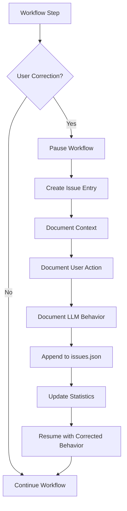

# Issues Tracking Implementation Plan

## Overview

This plan implements an LLM failure/ambiguity tracking mechanism for the reference-fill workflow, as proposed in [`workflow_review_001.md`](docs/workflows/reference-fill/outputs/reports/workflow_review_001.md).

## Problem Statement

From the workflow review, Issue #4 identified:

> **Problem:** There is no mechanism to detect and document when the LLM fails or encounters ambiguity during workflow execution.
>
> **Impact:** Failures and ambiguities are not tracked in a structured way, making it difficult to identify patterns, improve the workflow, or review problematic cases later.

## Proposed Solution

Create an `issues.json` file alongside `status.json` to track LLM failures, ambiguities, and user corrections in a structured format.

---

## Schema Design

### issues.json Structure

```json
{
  "workflow": "reference-fill",
  "version": "1.0.0",
  "created": "2026-02-19T00:00:00Z",
  "last_updated": "2026-02-19T00:00:00Z",
  "issues": [],
  "statistics": {
    "total_issues": 0,
    "by_type": {
      "ambiguity": 0,
      "failure": 0,
      "correction": 0,
      "clarification": 0
    },
    "by_severity": {
      "low": 0,
      "medium": 0,
      "high": 0
    }
  }
}
```

### Issue Entry Schema

Each issue entry will have the following structure:

```json
{
  "id": "issue_20260219_001",
  "timestamp": "2026-02-19T07:00:00Z",
  "type": "ambiguity|failure|correction|clarification",
  "severity": "low|medium|high",
  "trigger": "user_correction|multiple_clarifications|incomplete_response|incorrect_response",
  "context": {
    "mode": "fill|discovery|validate|status",
    "step": "step_name",
    "target_file": "path/to/file.md",
    "source_url": "https://..."
  },
  "description": "Human-readable description of the issue",
  "user_action": "What the user did to resolve/redirect",
  "llm_behavior": "What the LLM did incorrectly",
  "resolution": "How the issue was resolved",
  "suggested_improvement": "Potential workflow improvement to prevent recurrence"
}
```

---

## Issue Types and Triggers

### Types

| Type | Description |
|------|-------------|
| `ambiguity` | LLM encountered unclear situation and made wrong assumption |
| `failure` | LLM failed to complete a task correctly |
| `correction` | User had to redirect or correct LLM behavior |
| `clarification` | LLM requested clarification multiple times |

### Triggers

| Trigger | Description |
|---------|-------------|
| `user_correction` | User explicitly corrected LLM behavior |
| `multiple_clarifications` | LLM asked for clarification 2+ times on same topic |
| `incomplete_response` | LLM response was incomplete, required manual intervention |
| `incorrect_response` | LLM provided factually incorrect response |

### Severity Levels

| Level | Criteria |
|-------|----------|
| `low` | Minor inconvenience, workflow continued with small adjustment |
| `medium` | Required significant user intervention, slowed workflow |
| `high` | Blocked workflow progress, required restart or major correction |

---

## Workflow Integration

### When to Log Issues

The LLM should log an issue when:

1. **User redirects behavior** - User says something like "No, ask for HTML one tab at a time"
2. **User corrects response** - User says "That's wrong, the correct approach is..."
3. **Multiple clarifications needed** - LLM has to ask 2+ clarifying questions on the same step
4. **Manual intervention required** - User has to do something manually because LLM couldn't

### How to Log Issues

Add a new step in the workflow templates:

```markdown
### Issue Logging Step

⚠️ **CHECK:** Did the user just correct or redirect your behavior?

If YES, log the issue:
1. Create issue entry with appropriate type/trigger
2. Document what went wrong
3. Document user's correction
4. Append to issues.json
5. Continue workflow with corrected behavior
```

---

## Files to Create/Modify

### New Files

| File | Purpose |
|------|---------|
| `docs/workflows/reference-fill/issues.json` | Issue tracking database |
| `docs/workflows/reference-fill/templates/reference-fill.issues.md` | Issue logging template |

### Modified Files

| File | Changes |
|------|---------|
| `docs/workflows/reference-fill/rules.md` | Add issue tracking rules |
| `docs/workflows/reference-fill/templates/reference-fill.fill.md` | Add issue logging steps |
| `docs/workflows/reference-fill/status.json` | Add reference to issues.json |

---

## Implementation Steps

1. **Create issues.json template** - Initialize with empty issues array and statistics
2. **Update rules.md** - Add section on when/how to log issues
3. **Update fill.md template** - Add issue logging checkpoints
4. **Create issues.md template** - Template for logging individual issues
5. **Update status.json** - Add issues summary reference

---

## Example Issues from Review

Based on [`workflow_review_001.md`](docs/workflows/reference-fill/outputs/reports/workflow_review_001.md), here are example issue entries:

### Issue 1: Tertiary Tab Validation Missing

```json
{
  "id": "issue_20260215_001",
  "timestamp": "2026-02-15T09:00:00Z",
  "type": "ambiguity",
  "severity": "medium",
  "trigger": "incomplete_response",
  "context": {
    "mode": "fill",
    "step": "tertiary_tab_execution",
    "target_file": "finished/basketball/h2h/tertiary.md"
  },
  "description": "Workflow assumed tertiary tabs might not exist without providing option to validate their presence",
  "user_action": "Manually verified and documented absence of tertiary tabs",
  "llm_behavior": "Assumed absence without validation step",
  "resolution": "Added manual documentation that no tertiary tabs exist under H2H",
  "suggested_improvement": "Add explicit validation step before assuming tertiary tab absence"
}
```

### Issue 2: Unclear HTML Content Requests

```json
{
  "id": "issue_20260215_002",
  "timestamp": "2026-02-15T09:15:00Z",
  "type": "correction",
  "severity": "medium",
  "trigger": "user_correction",
  "context": {
    "mode": "fill",
    "step": "html_collection",
    "target_file": "finished/basketball/odds/tertiary.md"
  },
  "description": "LLM requested HTML content without specifying which specific tab",
  "user_action": "Redirected LLM to request HTML content one tab at a time with clear identification",
  "llm_behavior": "Asked for HTML content for multiple tabs at once without enumeration",
  "resolution": "LLM corrected to enumerate tabs and request HTML individually",
  "suggested_improvement": "Workflow should enumerate available tertiary tabs and request HTML for each individually"
}
```

---

## Benefits

1. **Pattern Identification** - Identify recurring issues to prioritize workflow improvements
2. **Quality Metrics** - Track LLM performance over time
3. **Training Data** - Use issues to improve LLM prompts and templates
4. **Accountability** - Document when and why manual intervention was needed
5. **Continuous Improvement** - Data-driven workflow refinement

---

## Mermaid Diagram: Issue Logging Flow



---

## Next Steps

After approval, switch to Code mode to:

1. Create `docs/workflows/reference-fill/issues.json`
2. Update `docs/workflows/reference-fill/rules.md`
3. Update `docs/workflows/reference-fill/templates/reference-fill.fill.md`
4. Create `docs/workflows/reference-fill/templates/reference-fill.issues.md`
