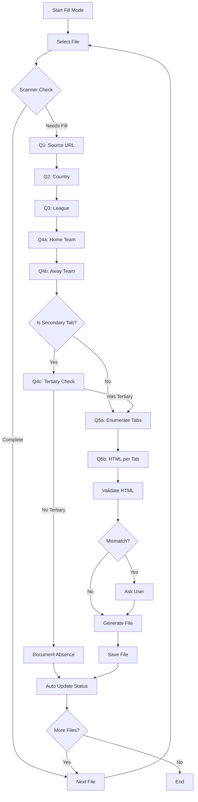

# Reference Fill Workflow Improvement Plan

**Date:** 2026-02-16
**Based on:** `docs/workflows/reference-fill/examples/workflow_review_001.md`

## Executive Summary

The Reference Fill Workflow has 4 critical issues that impact efficiency and tracking. This plan proposes specific improvements to the workflow templates and introduces new tracking mechanisms.

---

## Issue Analysis and Proposed Solutions

### Issue 1: Tertiary Tab Validation Missing

**Problem:** When executing tertiary tabs, the workflow assumed that secondary tabs might not have tertiary tabs and didn't provide options to validate their presence.

**Impact:** Required manual intervention to verify and document the absence of tertiary tabs under certain secondary tabs (e.g., H2H, Match).

**Current Workflow Gap:**
The fill template jumps directly to Q5 (HTML content) without first validating if tertiary tabs exist.

**Proposed Solution:**

Add a new step between Q4b and Q5 in [`reference-fill.fill.md`](docs/workflows/reference-fill/templates/reference-fill.fill.md):

```markdown
### Step 4c: Validate Tertiary Tab Existence

For secondary tab files, ask:

**Q4c - Tertiary Tab Check:**
```
Does this secondary tab have tertiary sub-tabs?

Steps to verify:
1. Go to: {source_url}
2. Click on: [SECONDARY TAB NAME]
3. Look for: Additional tab navigation below the secondary tab
4. Check for: data-testid="wcl-tabs" data-type="tertiary"

Options:
1. Yes - Tertiary tabs exist (continue to Q5)
2. No - No tertiary tabs (document and skip)
3. Unsure - Need help identifying
```
⚠️ GATE

**If "No":** Document the absence:
```markdown
## Notes

### Tertiary Tabs
No tertiary tabs exist under this secondary tab. Verified on {date}.
```

Then skip to Step 6 (Next File).
```

**Files to Modify:**
- [`docs/workflows/reference-fill/templates/reference-fill.fill.md`](docs/workflows/reference-fill/templates/reference-fill.fill.md:54)

---

### Issue 2: Unclear HTML Content Requests

**Problem:** When the workflow recognized that tertiary tabs existed, it asked for HTML content without specifying which specific tab to provide content for.

**Impact:** Required manual correction to request HTML content one tab at a time, slowing down the workflow execution.

**Current Workflow Gap:**
Q5 asks for HTML content generically without enumerating available tabs.

**Proposed Solution:**

Replace Q5 with a structured multi-step HTML collection process:

```markdown
### Step 5: HTML Collection (Structured)

**Q5a - Enumerate Tabs:**
```
List all available tabs at this level.

For primary tabs: Summary, Odds, H2H, Standings
For secondary tabs: List sub-tabs under current primary tab
For tertiary tabs: List sub-tabs under current secondary tab

Format:
| # | Tab Name | Status |
|---|----------|--------|
| 1 | [name] | pending |
| 2 | [name] | pending |
...
```
⚠️ GATE - Wait for tab list confirmation

**Q5b - HTML Content (One Tab at a Time):**
```
Now let's collect HTML for each tab one at a time.

**Current Tab:** [TAB NAME]

Steps:
1. Go to: {source_url}
2. Navigate to: [PARENT TAB] → [CURRENT TAB]
3. Wait for tab content to load
4. Right-click on tab navigation → Inspect
5. Find container with data-testid="wcl-tabs"
6. Copy → Copy outerHTML
7. Paste here

Expected selector: {expected_selector}
```
⚠️ GATE - Repeat for each tab

**Progress Tracking:**
After each tab, update the tab list:
| # | Tab Name | Status |
|---|----------|--------|
| 1 | [name] | ✅ collected |
| 2 | [name] | ⏳ current |
| 3 | [name] | pending |
```

**Files to Modify:**
- [`docs/workflows/reference-fill/templates/reference-fill.fill.md`](docs/workflows/reference-fill/templates/reference-fill.fill.md:89)

---

### Issue 3: Missing Automatic Status Update

**Problem:** After successfully updating reference files, the workflow did not automatically run the status update script.

**Impact:** Required manual execution of the status updater script to reflect the current progress in the status tracking.

**Current Workflow Gap:**
Step 6 only says "Repeat from Step 2" without running status updater.

**Proposed Solution:**

Add automatic status update after file generation:

```markdown
### Step 5b: Update Status Automatically

After successfully saving the file, run the status updater:

```powershell
powershell -ExecutionPolicy Bypass -File "docs\workflows\reference-fill\scripts\pwsh\status_updater.ps1"
```

**Expected Output:**
```
✅ Status updated
Files completed: X/28
Progress: XX%
```

If status update fails:
- Log warning but continue workflow
- Note: "Status update failed - manual update may be required"
```

**Files to Modify:**
- [`docs/workflows/reference-fill/templates/reference-fill.fill.md`](docs/workflows/reference-fill/templates/reference-fill.fill.md:115)

---

### Issue 4: No LLM Failure/Ambiguity Tracking

**Problem:** There is no mechanism to detect and document when the LLM fails or encounters ambiguity during workflow execution.

**Impact:** Failures and ambiguities are not tracked in a structured way, making it difficult to identify patterns, improve the workflow, or review problematic cases later.

**Proposed Solution:**

Create a new tracking file and update workflow templates to log issues.

#### 4a: Create Issues Tracking File

Create new file: `docs/workflows/reference-fill/issues.json`

```json
{
    "workflow": "reference-fill",
    "version": "1.1.0",
    "issues": [],
    "statistics": {
        "total_issues": 0,
        "by_type": {
            "ambiguity": 0,
            "failure": 0,
            "correction": 0,
            "timeout": 0
        },
        "by_resolution": {
            "resolved": 0,
            "pending": 0,
            "escalated": 0
        }
    }
}
```

#### 4b: Create Issues Documentation File

Create new file: `docs/workflows/reference-fill/issues.md`

```markdown
# LLM Issues Log

This file tracks LLM failures, ambiguities, and user corrections during workflow execution.

## Issue Types

| Type | Trigger | Example |
|------|---------|---------|
| Ambiguity | LLM requests clarification multiple times | "I need more information" repeated 3+ times |
| Failure | LLM provides incorrect response | Wrong HTML structure generated |
| Correction | User redirects LLM behavior | "Ask for HTML one tab at a time" |
| Timeout | LLM fails to respond | No response within expected time |

## Issue Log

### Issue Template

```markdown
### Issue #XXX - {Short Description}

**Date:** {timestamp}
**Type:** {ambiguity|failure|correction|timeout}
**Severity:** {low|medium|high}
**Context:** {workflow step, file being processed}
**Trigger:** {what caused the issue}
**User Action:** {how user resolved it}
**Resolution:** {outcome}
**Suggested Improvement:** {how to prevent in future}
```

## Active Issues

*No active issues*

## Resolved Issues

*No resolved issues yet*
```

#### 4c: Add Issue Detection to Workflow

Add to [`rules.md`](docs/workflows/reference-fill/rules.md):

```markdown
## Issue Detection and Logging

### Automatic Detection Triggers

The LLM should automatically log an issue when:

1. **User Correction Detected:**
   - User says "No, let me clarify..."
   - User says "Actually, do this instead..."
   - User says "That's not right..."

2. **Repeated Clarification:**
   - Same question asked 2+ times
   - User provides same information multiple times

3. **Workflow Deviation:**
   - Steps skipped or repeated unexpectedly
   - User manually intervenes in process

### Logging Process

When an issue is detected:

1. Pause current workflow step
2. Log the issue to `issues.json`
3. Document in `issues.md`
4. Ask user: "I've noted this issue. Should I continue or adjust the workflow?"

### Issue Log Entry Format

```json
{
    "id": "issue_{timestamp}",
    "timestamp": "{ISO8601}",
    "type": "{ambiguity|failure|correction|timeout}",
    "severity": "{low|medium|high}",
    "context": {
        "step": "{current_step}",
        "file": "{target_file}",
        "mode": "{current_mode}"
    },
    "trigger": "{what_happened}",
    "resolution": "{how_resolved}",
    "user_action": "{what_user_did}"
}
```
```

**Files to Create:**
- `docs/workflows/reference-fill/issues.json`
- `docs/workflows/reference-fill/issues.md`

**Files to Modify:**
- [`docs/workflows/reference-fill/rules.md`](docs/workflows/reference-fill/rules.md:155)

---

## Implementation Priority

| Priority | Issue | Effort | Impact |
|----------|-------|--------|--------|
| 1 | Issue 3: Auto Status Update | Low | High |
| 2 | Issue 2: Structured HTML Collection | Medium | High |
| 3 | Issue 1: Tertiary Tab Validation | Medium | Medium |
| 4 | Issue 4: Issue Tracking | Medium | Medium |

---

## Workflow Diagram (Proposed)



---

## Files Changed Summary

### New Files
| File | Purpose |
|------|---------|
| `docs/workflows/reference-fill/issues.json` | Structured issue tracking |
| `docs/workflows/reference-fill/issues.md` | Human-readable issue log |

### Modified Files
| File | Changes |
|------|---------|
| `templates/reference-fill.fill.md` | Add Q4c, restructure Q5, add auto status update |
| `rules.md` | Add issue detection and logging section |

---

---

## Additional Issues Discovered During Workflow Run

### Issue 5: LLM Used Bullet Points Instead of Numbered Options

**Problem:** The LLM presented options using bullet points/dashes instead of numbered options, breaking the expected format.

**Observed Output:**
```
What would you like to do?

Fill files - Add HTML samples to files needing fill
Validation - Validate existing reference files
Status - View detailed status information
```

**Expected Format (per rules.md):**
```
What would you like to do?

1. Fill files - Add HTML samples to files needing fill
2. Validation - Validate existing reference files
3. Status - View detailed status information
```

**Proposed Solution:**

Add explicit formatting rule to [`rules.md`](docs/workflows/reference-fill/rules.md):

```markdown
### Response Format Rules

**CRITICAL:** Always use numbered lists for user options, never bullet points.

**Correct:**
1. Option one
2. Option two
3. Option three

**Incorrect:**
- Option one
- Option two
- Option three

**Rationale:** Numbered options allow users to respond with just the number, speeding up interaction.
```

**Files to Modify:**
- [`docs/workflows/reference-fill/rules.md`](docs/workflows/reference-fill/rules.md)

---

### Issue 6: Scanner Script relative_path Field Shows Full Path

**Problem:** The scanner script's `relative_path` field outputs the full absolute path instead of a relative path.

**Observed Output:**
```json
{
    "relative_path": "C:\\Users\\tison\\Dev\\scorewise\\scrapamoja\\docs\\references\\flashscore\\html_samples\\README.md",
    ...
}
```

**Expected Output:**
```json
{
    "relative_path": "README.md",
    ...
}
```

**Root Cause:** In [`scanner.ps1`](docs/workflows/reference-fill/scripts/pwsh/scanner.ps1:114), the path replacement logic doesn't work correctly on Windows:

```powershell
"relative_path" = $file.FullName.Replace($InputPath, "").TrimStart('\', '/')
```

The `$InputPath` is a relative path like `docs/references/flashscore/html_samples` but `$file.FullName` is an absolute path like `C:\Users\...\docs\references\flashscore\html_samples\...`. The `.Replace()` doesn't match because one is relative and one is absolute.

**Proposed Solution:**

Fix the scanner script to properly resolve paths:

```powershell
# Resolve InputPath to absolute path for comparison
$resolvedInputPath = (Resolve-Path $InputPath -ErrorAction SilentlyContinue).Path
if (-not $resolvedInputPath) {
    $resolvedInputPath = $InputPath
}

# Calculate relative path properly
$relativePath = $file.FullName.Replace($resolvedInputPath, "").TrimStart('\', '/')
```

**Files to Modify:**
- [`docs/workflows/reference-fill/scripts/pwsh/scanner.ps1`](docs/workflows/reference-fill/scripts/pwsh/scanner.ps1:114)

---

### Issue 7: File List Display Shows Incorrect Paths

**Problem:** When the LLM displays the file list to the user, it shows paths without the sport subdirectory (e.g., `live/h2h/secondary.md` instead of `live/basketball/h2h/secondary.md`).

**Observed Output:**
```
Files needing fill:

README.md (unknown category) - 9.7KB
live/h2h/secondary.md - 645B
live/h2h/tertiary.md - 847B
```

**Expected Output:**
```
Files needing fill:

README.md (unknown category) - 9.7KB
live/basketball/h2h/secondary.md - 645B
live/basketball/h2h/tertiary.md - 847B
```

**Root Cause:** The LLM is misinterpreting the scan results or the scan results don't include sport in the path structure.

**Proposed Solution:**

1. Fix the scanner to properly extract and include sport in the path
2. Add a `sport` field to the file info in scanner output
3. Update the fill template to display full paths

**Files to Modify:**
- [`docs/workflows/reference-fill/scripts/pwsh/scanner.ps1`](docs/workflows/reference-fill/scripts/pwsh/scanner.ps1)
- [`docs/workflows/reference-fill/templates/reference-fill.fill.md`](docs/workflows/reference-fill/templates/reference-fill.fill.md)

---

## Updated Implementation Priority

| Priority | Issue | Effort | Impact | Category |
|----------|-------|--------|--------|----------|
| 1 | Issue 6: Scanner relative_path bug | Low | High | Bug Fix |
| 2 | Issue 3: Auto Status Update | Low | High | Enhancement |
| 3 | Issue 5: Numbered options format | Low | Medium | Bug Fix |
| 4 | Issue 2: Structured HTML Collection | Medium | High | Enhancement |
| 5 | Issue 7: File list path display | Medium | Medium | Bug Fix |
| 6 | Issue 1: Tertiary Tab Validation | Medium | Medium | Enhancement |
| 7 | Issue 4: Issue Tracking | Medium | Medium | Enhancement |

---

## Files Changed Summary (Updated)

### New Files
| File | Purpose |
|------|---------|
| `docs/workflows/reference-fill/issues.json` | Structured issue tracking |
| `docs/workflows/reference-fill/issues.md` | Human-readable issue log |

### Modified Files
| File | Changes |
|------|---------|
| `scripts/pwsh/scanner.ps1` | Fix relative_path calculation, add sport field |
| `templates/reference-fill.fill.md` | Add Q4c, restructure Q5, add auto status update, fix path display |
| `rules.md` | Add issue detection, add numbered options format rule |

---

## Next Steps

1. Review this plan and approve/describe changes
2. Switch to Code mode to implement changes
3. Test workflow with a sample file
4. Update workflow documentation

