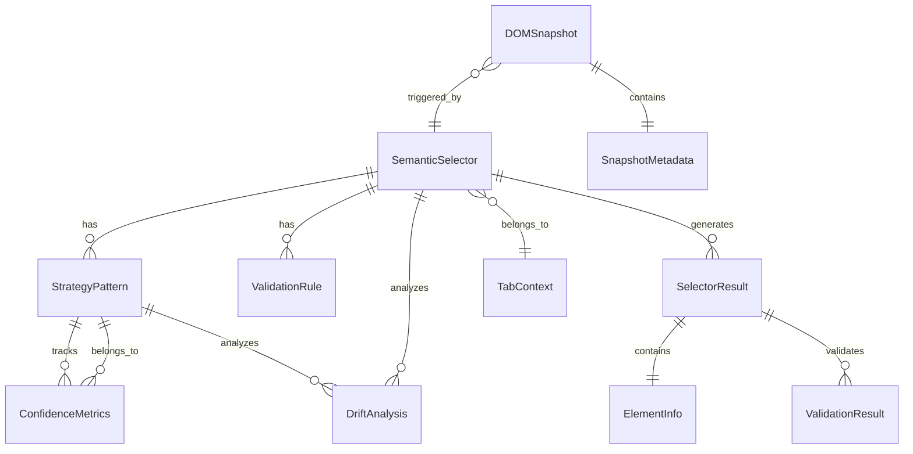
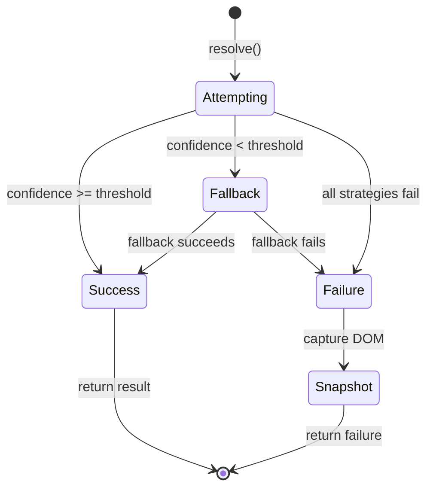
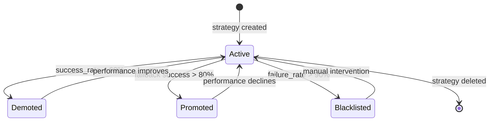

# Data Model: Selector Engine

**Date**: 2025-01-27  
**Purpose**: Define entities, relationships, and validation rules for Selector Engine  
**Status**: Complete

## Core Entities

### 1. SemanticSelector

Represents business meaning mapped to DOM reality with multiple resolution strategies.

**Attributes**:
- `name: str` - Unique semantic identifier (e.g., "home_team_name")
- `description: str` - Human-readable description of the selector's purpose
- `context: str` - Tab context where selector is valid (e.g., "summary", "odds", "h2h")
- `strategies: List[StrategyPattern]` - Ordered list of resolution strategies
- `validation_rules: List[ValidationRule]` - Content validation criteria
- `confidence_threshold: float` - Minimum confidence for reliable resolution (default: 0.8)
- `metadata: Dict[str, Any]` - Additional configuration and notes

**Relationships**:
- Has many StrategyPattern (ordered by priority)
- Has many ValidationRule
- Belongs to TabContext
- Has many SelectorResult (historical)

**Validation Rules**:
- `name` must be unique within context
- `strategies` must have at least 3 items (primary, secondary, tertiary)
- `confidence_threshold` must be between 0.0 and 1.0
- `context` must be a valid tab name

### 2. StrategyPattern

Defines a specific approach to element resolution with implementation details.

**Attributes**:
- `id: str` - Unique strategy identifier
- `type: StrategyType` - Enum: TEXT_ANCHOR, ATTRIBUTE_MATCH, DOM_RELATIONSHIP, ROLE_BASED
- `priority: int` - Priority order (1 = highest)
- `config: Dict[str, Any]` - Strategy-specific configuration
- `success_rate: float` - Historical success rate (0.0-1.0)
- `avg_resolution_time: float` - Average resolution time in milliseconds
- `is_active: bool` - Whether strategy is currently enabled
- `created_at: datetime` - Strategy creation timestamp
- `last_updated: datetime` - Last performance update

**Strategy Types**:

**TEXT_ANCHOR**:
- `anchor_text: str` - Text to search for
- `proximity_selector: str` - Optional selector for proximity context
- `case_sensitive: bool` - Whether text matching is case sensitive

**ATTRIBUTE_MATCH**:
- `attribute: str` - Attribute name to match
- `value_pattern: str` - Regex pattern for attribute value
- `element_tag: str` - Optional element tag filter

**DOM_RELATIONSHIP**:
- `parent_selector: str` - Parent element selector
- `child_index: int` - Child element index
- `relationship_type: str` - Type of relationship (child, sibling, descendant)

**ROLE_BASED**:
- `role: str` - ARIA role or semantic role
- `semantic_attribute: str` - Semantic attribute name
- `expected_value: str` - Expected attribute value

**Validation Rules**:
- `priority` must be unique within selector
- `success_rate` must be between 0.0 and 1.0
- `avg_resolution_time` must be positive
- Strategy-specific config must be valid for type

### 3. SelectorResult

Contains resolved element information with confidence assessment.

**Attributes**:
- `selector_name: str` - Reference to SemanticSelector
- `strategy_used: str` - ID of StrategyPattern that succeeded
- `element_info: ElementInfo` - Information about resolved element
- `confidence_score: float` - Confidence assessment (0.0-1.0)
- `resolution_time: float` - Time taken to resolve in milliseconds
- `validation_results: List[ValidationResult]` - Content validation outcomes
- `context_state: Dict[str, Any]` - Tab and page state during resolution
- `timestamp: datetime` - When resolution occurred
- `success: bool` - Whether resolution was successful

**ElementInfo**:
- `tag_name: str` - HTML tag of resolved element
- `text_content: str` - Text content of element
- `attributes: Dict[str, str]` - Element attributes
- `css_classes: List[str]` - CSS class names
- `dom_path: str` - Full DOM path to element

**Validation Rules**:
- `confidence_score` must be between 0.0 and 1.0
- `resolution_time` must be positive
- `strategy_used` must reference valid StrategyPattern
- Either `element_info` or failure reason must be present

### 4. DOMSnapshot

Captured page state with metadata for failure analysis and drift detection.

**Attributes**:
- `id: str` - Unique snapshot identifier
- `selector_name: str` - Selector that triggered snapshot
- `snapshot_type: SnapshotType` - Enum: FAILURE, DRIFT_ANALYSIS, MANUAL
- `dom_content: str` - Compressed HTML content
- `metadata: SnapshotMetadata` - Capture context and information
- `file_path: str` - Path to stored snapshot file
- `created_at: datetime` - Snapshot creation timestamp
- `file_size: int` - Size of compressed file in bytes

**SnapshotMetadata**:
- `page_url: str` - URL of page when captured
- `tab_context: str` - Active tab context
- `viewport_size: Tuple[int, int]` - Browser viewport dimensions
- `user_agent: str` - Browser user agent
- `resolution_attempt: int` - Which resolution attempt triggered snapshot
- `failure_reason: str` - Why snapshot was captured
- `performance_metrics: Dict[str, float]` - Page performance metrics

**Validation Rules**:
- `dom_content` must be valid HTML when decompressed
- `file_size` must be reasonable (< 10MB compressed)
- `selector_name` must reference valid SemanticSelector

### 5. ConfidenceMetrics

Tracks success rates, performance, and reliability statistics per selector.

**Attributes**:
- `selector_name: str` - Reference to SemanticSelector
- `strategy_id: str` - Reference to StrategyPattern
- `total_attempts: int` - Total resolution attempts
- `successful_attempts: int` - Successful resolutions
- `failed_attempts: int` - Failed resolutions
- `avg_confidence: float` - Average confidence score
- `avg_resolution_time: float` - Average resolution time
- `last_success: datetime` - Last successful resolution
- `last_failure: datetime` - Last failed resolution
- `current_streak: int` - Current success/failure streak
- `updated_at: datetime` - Last metrics update

**Calculated Fields**:
- `success_rate: float` - successful_attempts / total_attempts
- `failure_rate: float` - failed_attempts / total_attempts
- `reliability_score: float` - Weighted combination of success rate and confidence

**Validation Rules**:
- `total_attempts` must equal `successful_attempts + failed_attempts`
- All rates must be between 0.0 and 1.0
- `avg_confidence` and `avg_resolution_time` must be positive

### 6. DriftAnalysis

Contains patterns and trends in selector performance over time.

**Attributes**:
- `selector_name: str` - Reference to SemanticSelector
- `analysis_period: DateRange` - Period covered by analysis
- `drift_score: float` - Drift severity score (0.0-1.0)
- `trend_direction: TrendDirection` - Enum: IMPROVING, STABLE, DEGRADING
- `strategy_performance: Dict[str, PerformanceTrend]` - Per-strategy trends
- `recommendations: List[str]` - Automated recommendations
- `manual_review_required: bool` - Whether manual review is needed
- `created_at: datetime` - Analysis creation timestamp

**PerformanceTrend**:
- `strategy_id: str` - Strategy identifier
- `success_rate_trend: float` - Success rate change over period
- `confidence_trend: float` - Confidence score change over period
- `performance_trend: float` - Resolution time change over period
- `volatility: float` - Performance volatility score

**Validation Rules**:
- `drift_score` must be between 0.0 and 1.0
- `analysis_period` must have valid start and end dates
- All trend values must be between -1.0 and 1.0

## Supporting Entities

### 7. ValidationRule

Defines content validation criteria for selectors.

**Attributes**:
- `type: ValidationType` - Enum: REGEX, DATA_TYPE, SEMANTIC, CUSTOM
- `pattern: str` - Validation pattern or rule
- `required: bool` - Whether validation is required
- `weight: float` - Weight in confidence calculation (0.0-1.0)

**Validation Types**:
- `REGEX`: Pattern matching against text content
- `DATA_TYPE`: Type validation (number, date, boolean)
- `SEMANTIC`: Semantic meaning validation
- `CUSTOM`: Custom validation function

### 8. TabContext

Defines tab-specific context for selector scoping.

**Attributes**:
- `name: str` - Tab identifier
- `container_selector: str` - CSS selector for tab container
- `activation_selector: str` - CSS selector to activate tab
- `is_available: bool` - Whether tab is available for current match
- `load_timeout: float` - Timeout for tab content loading

### 9. ElementInfo

Detailed information about resolved DOM elements.

**Attributes**:
- `tag_name: str` - HTML tag name
- `text_content: str` - Text content (trimmed)
- `attributes: Dict[str, str]` - All element attributes
- `css_classes: List[str]` - CSS class names
- `dom_path: str` - Full DOM path from body
- `visibility: bool` - Whether element is visible
- `interactable: bool` - Whether element can be interacted with

## Entity Relationships

## State Transitions

### Selector Resolution State Machine

### Strategy Evolution State Machine

## Data Validation Rules

### Cross-Entity Validation

1. **Selector-Strategy Consistency**: All strategies must be compatible with selector context
2. **Confidence Threshold Validation**: Selector thresholds must be >= 0.5 and <= 1.0
3. **Strategy Priority Uniqueness**: Strategy priorities must be unique within selector
4. **Performance Data Consistency**: Metrics must accurately reflect result history
5. **Snapshot File Integrity**: Snapshot files must match stored metadata

### Business Logic Validation

1. **Multi-Strategy Requirement**: Selectors must have at least 3 strategies
2. **Confidence Threshold Enforcement**: Results below threshold must trigger fallback
3. **Context Scoping Enforcement**: Selectors must only resolve within valid context
4. **Drift Detection Thresholds**: Drift scores above 0.7 must trigger alerts
5. **Performance Thresholds**: Resolution times above 1000ms must trigger optimization

## Schema Versioning

### Current Version: 1.0.0

**Version History**:
- **1.0.0**: Initial schema with core entities and relationships

**Migration Considerations**:
- Add new fields with default values
- Maintain backward compatibility for existing selectors
- Provide migration scripts for performance metrics
- Update validation rules as needed

**Future Schema Changes**:
- **1.1.0**: Add machine learning strategy patterns
- **1.2.0**: Add distributed selector resolution
- **2.0.0**: Major architecture changes (if needed)
