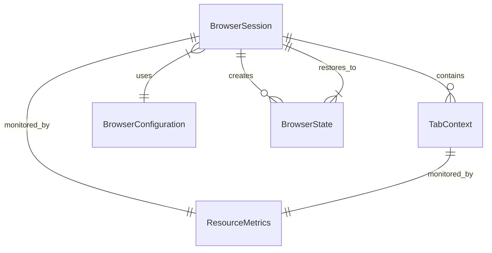

# Data Model: Browser Lifecycle Management

**Feature**: Browser Lifecycle Management  
**Date**: 2025-01-27  
**Phase**: 1 - Design & Contracts

## Entity Overview

This document defines the core data entities for the Browser Lifecycle Management feature, extracted from the functional requirements and user stories.

## Core Entities

### BrowserSession

Represents a browser instance with its configuration, state, and resource usage.

**Attributes**:
- `session_id`: str - Unique identifier for the browser session
- `browser_type`: str - Browser engine (chromium, firefox, webkit)
- `configuration`: BrowserConfiguration - Session-specific settings
- `status`: SessionStatus - Current lifecycle state (initializing, active, closing, terminated)
- `created_at`: datetime - Session creation timestamp
- `last_activity`: datetime - Last activity timestamp
- `resource_metrics`: ResourceMetrics - Current resource usage
- `contexts`: List[TabContext] - Associated browser contexts/tabs
- `process_id`: Optional[int] - Browser process ID for monitoring

**Relationships**:
- Has many TabContext entities
- Uses BrowserConfiguration for settings
- Monitored by ResourceMetrics

**State Transitions**:
```
initializing → active → closing → terminated
     ↓           ↓        ↓
   failed ←───┘        cleanup_error
```

**Validation Rules**:
- session_id must be unique across all sessions
- browser_type must be supported by Playwright
- status transitions must follow defined state machine
- resource_metrics cannot exceed configured thresholds

### TabContext

Represents a browser tab with its own navigation history and DOM state.

**Attributes**:
- `context_id`: str - Unique identifier within the session
- `session_id`: str - Parent browser session reference
- `url`: Optional[str] - Current page URL
- `title`: Optional[str] - Page title
- `navigation_history`: List[str] - URLs visited in this context
- `created_at`: datetime - Context creation timestamp
- `last_activity`: datetime - Last activity timestamp
- `is_active`: bool - Whether this is the currently active context
- `dom_state`: Optional[dict] - Current DOM snapshot for debugging

**Relationships**:
- Belongs to BrowserSession
- Contains navigation history
- May reference DOM state for debugging

**Validation Rules**:
- context_id must be unique within the session
- session_id must reference existing BrowserSession
- Only one context can be active per session
- navigation_history limited to last 100 URLs

### BrowserState

Serializable collection of cookies, storage, and authentication data.

**Attributes**:
- `state_id`: str - Unique identifier for the saved state
- `session_id`: str - Original session identifier
- `cookies`: List[CookieData] - Browser cookies
- `local_storage`: Dict[str, str] - localStorage contents
- `session_storage`: Dict[str, str] - sessionStorage contents
- `authentication_tokens`: Dict[str, Any] - Auth tokens and session data
- `user_agent`: str - Browser user agent string
- `viewport`: ViewportSettings - Browser viewport configuration
- `created_at`: datetime - State creation timestamp
- `expires_at`: Optional[datetime] - State expiration time
- `schema_version`: str - Data format version for compatibility

**Relationships**:
- Created from BrowserSession
- Can be restored to new BrowserSession

**Validation Rules**:
- cookies must follow standard cookie format
- storage data must be JSON serializable
- authentication_tokens must be encrypted at rest
- schema_version must be supported

### ResourceMetrics

Real-time monitoring data for browser resource consumption.

**Attributes**:
- `session_id`: str - Associated browser session
- `context_id`: Optional[str] - Specific context if available
- `timestamp`: datetime - Metrics collection timestamp
- `memory_usage_mb`: float - Memory usage in megabytes
- `cpu_usage_percent`: float - CPU usage percentage
- `disk_usage_mb`: float - Disk usage for cache/profile
- `network_requests_count`: int - Number of network requests
- `open_tabs_count`: int - Number of open tabs
- `process_handles_count`: int - Number of file handles
- `alert_status`: AlertStatus - Resource alert status (normal, warning, critical)

**Relationships**:
- Belongs to BrowserSession
- Optionally belongs to TabContext

**Validation Rules**:
- All numeric values must be non-negative
- cpu_usage_percent cannot exceed 100%
- timestamp must be recent (within last 5 minutes)

### BrowserConfiguration

Set of browser settings including stealth options and proxy configuration.

**Attributes**:
- `config_id`: str - Unique configuration identifier
- `browser_type`: str - Browser engine selection
- `headless`: bool - Run browser in headless mode
- `viewport`: ViewportSettings - Screen dimensions and settings
- `user_agent`: Optional[str] - Custom user agent string
- `proxy_settings`: Optional[ProxySettings] - Proxy configuration
- `stealth_settings`: StealthSettings - Anti-detection configuration
- `permissions`: List[str] - Browser permissions
- `ignore_https_errors`: bool - Ignore certificate errors
- `locale`: str - Browser locale setting
- `timezone`: str - Browser timezone setting

**Sub-entities**:

**ViewportSettings**:
- `width`: int - Screen width in pixels
- `height`: int - Screen height in pixels
- `device_scale_factor`: float - Device pixel ratio
- `is_mobile`: bool - Mobile device emulation
- `has_touch`: bool - Touch screen support

**ProxySettings**:
- `server`: str - Proxy server URL
- `username`: Optional[str] - Proxy username
- `password`: Optional[str] - Proxy password
- `bypass_list`: List[str] - Bypass proxy for these hosts

**StealthSettings**:
- `fingerprint_randomization`: bool - Randomize browser fingerprint
- `mouse_movement_simulation`: bool - Simulate human mouse movement
- `typing_simulation`: bool - Simulate human typing patterns
- `scroll_simulation`: bool - Simulate natural scrolling
- `timing_randomization`: bool - Add random delays to actions

**Validation Rules**:
- viewport dimensions must be positive integers
- proxy server must be valid URL if provided
- stealth settings must be compatible with target sites

## Supporting Data Types

### CookieData
- `name`: str - Cookie name
- `value`: str - Cookie value
- `domain`: str - Cookie domain
- `path`: str - Cookie path
- `expires`: Optional[datetime] - Expiration time
- `secure`: bool - Secure flag
- `http_only`: bool - HttpOnly flag
- `same_site`: str - SameSite policy

### SessionStatus (Enum)
- `INITIALIZING` - Browser starting up
- `ACTIVE` - Ready for operations
- `CLOSING` - Shutdown in progress
- `TERMINATED` - Fully shutdown
- `FAILED` - Error state
- `CLEANUP_ERROR` - Cleanup failed

### AlertStatus (Enum)
- `NORMAL` - Resource usage within limits
- `WARNING` - Approaching threshold
- `CRITICAL` - Exceeded threshold, cleanup needed

## Data Relationships



## JSON Schema Examples

### BrowserSession JSON
```json
{
  "session_id": "sess_1234567890",
  "browser_type": "chromium",
  "status": "active",
  "created_at": "2025-01-27T10:00:00Z",
  "last_activity": "2025-01-27T10:15:30Z",
  "configuration": {
    "config_id": "cfg_default",
    "browser_type": "chromium",
    "headless": true,
    "viewport": {
      "width": 1920,
      "height": 1080,
      "device_scale_factor": 1.0,
      "is_mobile": false,
      "has_touch": false
    }
  },
  "resource_metrics": {
    "memory_usage_mb": 256.5,
    "cpu_usage_percent": 15.2,
    "alert_status": "normal"
  }
}
```

### BrowserState JSON
```json
{
  "state_id": "state_1234567890",
  "session_id": "sess_1234567890",
  "schema_version": "1.0.0",
  "created_at": "2025-01-27T10:15:30Z",
  "cookies": [
    {
      "name": "session_id",
      "value": "abc123",
      "domain": "example.com",
      "path": "/",
      "secure": true,
      "http_only": true
    }
  ],
  "local_storage": {
    "user_preferences": "{\"theme\":\"dark\"}"
  },
  "authentication_tokens": {
    "oauth_token": "encrypted_token_data"
  }
}
```

## Data Validation

All entities implement comprehensive validation:
- Type checking with proper error messages
- Business rule validation (state transitions, thresholds)
- Referential integrity (foreign keys, existence checks)
- Schema validation for JSON serialization/deserialization

## Performance Considerations

- ResourceMetrics collected efficiently to minimize overhead
- BrowserState compression for large storage data
- Lazy loading for navigation history
- Memory-efficient data structures for high concurrency
