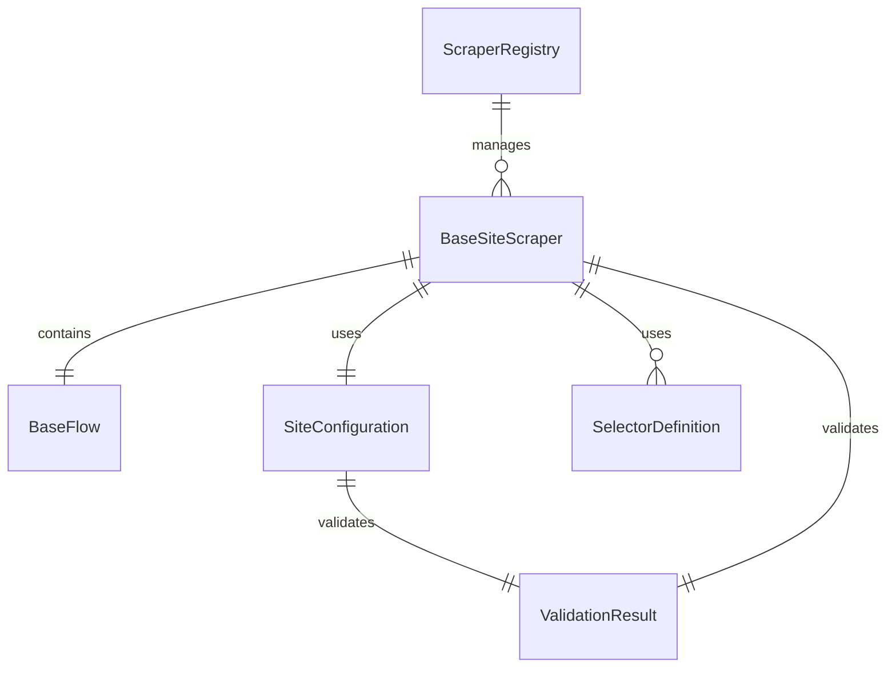

# Data Model: Site Scraper Template System

**Feature**: 013-site-scraper-template  
**Date**: 2025-01-29  
**Purpose**: Entity definitions and data structures for the site scraper framework

## Core Entities

### BaseSiteScraper

Abstract base class defining the contract for all site scrapers.

**Attributes**:
- `site_id: str` - Unique identifier for the scraper
- `site_name: str` - Human-readable name of the site
- `base_url: str` - Base URL for the site
- `page: Page` - Playwright page instance (injected)
- `selector_engine: SelectorEngine` - Selector engine instance (injected)
- `flow: BaseFlow` - Navigation flow instance

**Required Methods**:
- `async navigate() -> None` - Bring page to initial ready state
- `async scrape(**kwargs) -> dict` - Perform scraping using selectors
- `normalize(raw_data: dict) -> dict` - Return structured output

**Validation Rules**:
- site_id must be unique across all scrapers
- base_url must be valid URL format
- All required methods must be implemented

### BaseFlow

Abstract base class for navigation-only logic.

**Attributes**:
- `page: Page` - Playwright page instance (injected)
- `selector_engine: SelectorEngine` - Selector engine instance (injected)

**Required Methods**:
- No required methods (base class for navigation methods)

**Constraints**:
- Must not contain scraping logic
- Must not contain data normalization
- Must only handle navigation and page interactions

### SiteConfiguration

Metadata structure containing site information.

**Fields**:
- `id: str` - Unique site identifier
- `name: str` - Human-readable site name
- `base_url: str` - Base URL for the site
- `version: str` - Scraper version (semantic versioning)
- `maintainer: str` - Scraper maintainer name/email
- `description: str` - Optional site description
- `tags: List[str]` - Optional tags for categorization

**Validation Rules**:
- id must match regex: `^[a-z0-9_]+$`
- base_url must be valid URL
- version must follow semantic versioning
- All string fields must be non-empty

### ScraperRegistry

Central system for discovering and managing available scrapers.

**Attributes**:
- `scrapers: Dict[str, Type[BaseSiteScraper]]` - Registry of scraper classes
- `metadata: Dict[str, SiteConfiguration]` - Site metadata cache

**Methods**:
- `register(site_id: str, scraper_class: Type[BaseSiteScraper]) -> None`
- `get_scraper(site_id: str) -> Type[BaseSiteScraper]`
- `list_scrapers() -> List[str]`
- `get_metadata(site_id: str) -> SiteConfiguration`

**Validation Rules**:
- site_id must be unique
- scraper_class must inherit from BaseSiteScraper
- All registered scrapers must pass validation

### SelectorDefinition

YAML-based selector configuration structure.

**Fields**:
- `description: str` - Human-readable description
- `confidence_threshold: float` - Minimum confidence threshold (0.0-1.0)
- `strategies: List[SelectorStrategy]` - Resolution strategies
- `timeout: Optional[float]` - Selector timeout in seconds
- `retry_count: Optional[int]` - Number of retry attempts

**SelectorStrategy Fields**:
- `type: str` - Strategy type (css, xpath, text, etc.)
- `selector: str` - Selector string
- `weight: Optional[float]` - Strategy weight for confidence calculation

**Validation Rules**:
- confidence_threshold must be between 0.0 and 1.0
- At least one strategy must be provided
- All strategy types must be supported

### ValidationResult

Structure containing validation results for scraper implementations.

**Fields**:
- `valid: bool` - Overall validation status
- `errors: List[str]` - Critical validation errors
- `warnings: List[str]` - Non-critical validation warnings
- `missing_files: List[str]` - List of missing required files
- `invalid_selectors: List[str]` - List of invalid selector files

**Methods**:
- `add_error(message: str) -> None`
- `add_warning(message: str) -> None`
- `is_valid() -> bool`

## Data Relationships



## State Transitions

### Scraper Lifecycle

1. **Registration**: Scraper class registered in ScraperRegistry
2. **Validation**: ValidationResult generated during startup
3. **Instantiation**: Scraper instance created with page and selector_engine
4. **Navigation**: Flow methods called to reach initial state
5. **Scraping**: Main scraping logic executed
6. **Normalization**: Raw data transformed to structured output

### Validation Flow

1. **File Existence Check**: Verify required files exist
2. **Configuration Validation**: Validate SITE_CONFIG structure
3. **Interface Compliance**: Check BaseSiteScraper implementation
4. **Selector Validation**: Validate YAML selector files
5. **Registry Validation**: Ensure unique site_id

## Schema Definitions

### Site Configuration Schema

```json
{
  "type": "object",
  "required": ["id", "name", "base_url", "version", "maintainer"],
  "properties": {
    "id": {
      "type": "string",
      "pattern": "^[a-z0-9_]+$"
    },
    "name": {
      "type": "string",
      "minLength": 1
    },
    "base_url": {
      "type": "string",
      "format": "uri"
    },
    "version": {
      "type": "string",
      "pattern": "^\\d+\\.\\d+\\.\\d+$"
    },
    "maintainer": {
      "type": "string",
      "minLength": 1
    },
    "description": {
      "type": "string"
    },
    "tags": {
      "type": "array",
      "items": {
        "type": "string"
      }
    }
  }
}
```

### Selector Definition Schema

```json
{
  "type": "object",
  "required": ["description", "confidence_threshold", "strategies"],
  "properties": {
    "description": {
      "type": "string",
      "minLength": 1
    },
    "confidence_threshold": {
      "type": "number",
      "minimum": 0.0,
      "maximum": 1.0
    },
    "strategies": {
      "type": "array",
      "minItems": 1,
      "items": {
        "type": "object",
        "required": ["type", "selector"],
        "properties": {
          "type": {
            "type": "string",
            "enum": ["css", "xpath", "text", "attribute", "role"]
          },
          "selector": {
            "type": "string",
            "minLength": 1
          },
          "weight": {
            "type": "number",
            "minimum": 0.0,
            "maximum": 1.0
          }
        }
      }
    },
    "timeout": {
      "type": "number",
      "minimum": 0
    },
    "retry_count": {
      "type": "integer",
      "minimum": 0
    }
  }
}
```

## Integration Points

### Selector Engine Integration

- SelectorDefinition integrates with existing multi-strategy selector engine
- Confidence thresholds passed to selector engine for resolution
- Strategy types mapped to existing selector engine strategies

### Browser Lifecycle Integration

- BaseSiteScraper receives Playwright page instance through dependency injection
- Flow methods use existing browser lifecycle management
- Page state managed through existing tab and session management

### Configuration Integration

- SiteConfiguration extends existing configuration patterns
- Validation integrates with existing configuration validation
- Error handling follows existing structured logging patterns
