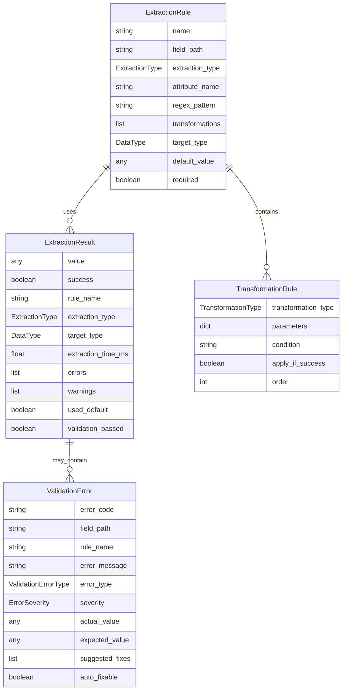
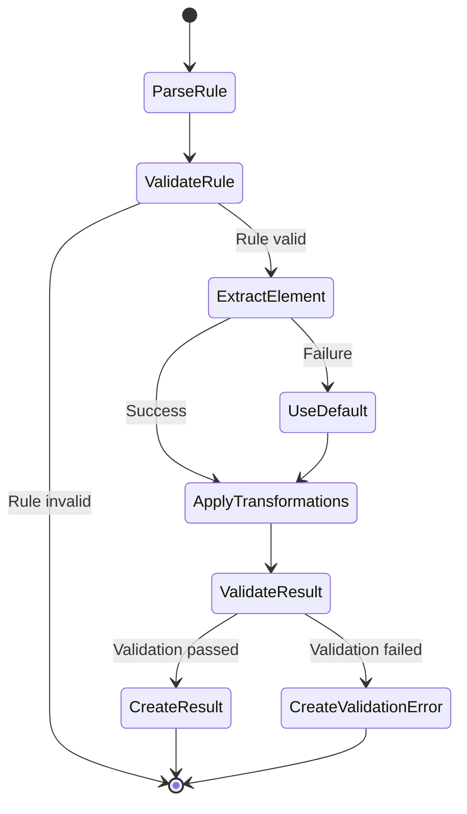
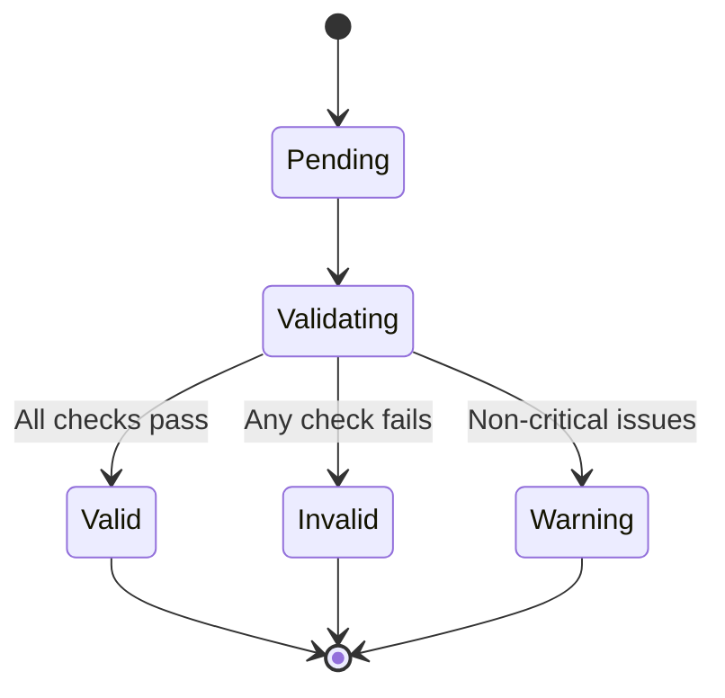

# Data Model: Extractor Module

**Date**: 2025-01-29  
**Feature**: Extractor Module  
**Status**: Complete

## Entity Overview

The Extractor Module operates on four core entities that define the extraction process, rules, results, and error handling. These entities are designed to be serializable, validatable, and extensible.

## Core Entities

### 1. ExtractionRule

Defines how to extract data from an element with comprehensive configuration options.

```python
class ExtractionRule(BaseModel):
    """Defines extraction rules for a specific data field."""
    
    # Core identification
    name: str = Field(..., description="Unique name for this extraction rule")
    field_path: str = Field(..., description="Path to the field in output structure")
    
    # Extraction targets
    extraction_type: ExtractionType = Field(..., description="Type of extraction to perform")
    attribute_name: Optional[str] = Field(None, description="Attribute name for attribute extraction")
    
    # Pattern matching
    regex_pattern: Optional[str] = Field(None, description="Regex pattern for pattern extraction")
    regex_flags: int = Field(0, description="Regex flags (re.IGNORECASE, etc.)")
    
    # Data transformation
    transformations: List[TransformationType] = Field(default_factory=list, description="Transformations to apply")
    
    # Type conversion
    target_type: DataType = Field(DataType.TEXT, description="Target data type")
    date_format: Optional[str] = Field(None, description="Date format string for parsing")
    
    # Fallback handling
    default_value: Any = Field(None, description="Default value if extraction fails")
    required: bool = Field(False, description="Whether this field is required")
    
    # Validation
    validation_pattern: Optional[str] = Field(None, description="Validation regex pattern")
    min_length: Optional[int] = Field(None, description="Minimum length for text")
    max_length: Optional[int] = Field(None, description="Maximum length for text")
    min_value: Optional[Union[int, float]] = Field(None, description="Minimum value for numbers")
    max_value: Optional[Union[int, float]] = Field(None, description="Maximum value for numbers")
    
    # Metadata
    description: Optional[str] = Field(None, description="Human-readable description")
    tags: List[str] = Field(default_factory=list, description="Tags for categorization")
```

**Enums**:
```python
class ExtractionType(str, Enum):
    """Types of extraction operations."""
    TEXT = "text"
    ATTRIBUTE = "attribute"
    REGEX = "regex"
    LIST = "list"
    NESTED = "nested"

class TransformationType(str, Enum):
    """Types of data transformations."""
    TRIM = "trim"
    CLEAN = "clean"
    NORMALIZE = "normalize"
    LOWERCASE = "lowercase"
    UPPERCASE = "uppercase"
    REMOVE_WHITESPACE = "remove_whitespace"
    EXTRACT_NUMBERS = "extract_numbers"
    EXTRACT_EMAILS = "extract_emails"
    EXTRACT_PHONES = "extract_phones"

class DataType(str, Enum):
    """Target data types for extracted values."""
    TEXT = "text"
    INTEGER = "integer"
    FLOAT = "float"
    BOOLEAN = "boolean"
    DATE = "date"
    DATETIME = "datetime"
    LIST = "list"
    DICT = "dict"
```

### 2. ExtractionResult

Contains the extracted value, metadata, and any warnings/errors from the extraction process.

```python
class ExtractionResult(BaseModel):
    """Result of an extraction operation with metadata."""
    
    # Core result
    value: Any = Field(..., description="Extracted value")
    success: bool = Field(..., description="Whether extraction was successful")
    
    # Metadata
    rule_name: str = Field(..., description="Name of the rule used")
    extraction_type: ExtractionType = Field(..., description="Type of extraction performed")
    target_type: DataType = Field(..., description="Target data type")
    
    # Performance metrics
    extraction_time_ms: float = Field(..., description="Time taken for extraction in milliseconds")
    transformations_applied: List[TransformationType] = Field(default_factory=list, description="Transformations applied")
    
    # Error handling
    errors: List[str] = Field(default_factory=list, description="Errors encountered during extraction")
    warnings: List[str] = Field(default_factory=list, description="Warnings during extraction")
    used_default: bool = Field(False, description="Whether default value was used")
    
    # Validation
    validation_passed: bool = Field(True, description="Whether validation passed")
    validation_errors: List[str] = Field(default_factory=list, description="Validation errors")
    
    # Context
    element_info: Optional[Dict[str, Any]] = Field(None, description="Information about the source element")
    extraction_context: Optional[Dict[str, Any]] = Field(None, description="Additional context")
    
    # Timestamps
    extracted_at: datetime = Field(default_factory=datetime.utcnow, description="When extraction was performed")
```

### 3. TransformationRule

Defines how to transform extracted data with chaining support.

```python
class TransformationRule(BaseModel):
    """Defines data transformation rules."""
    
    # Core transformation
    transformation_type: TransformationType = Field(..., description="Type of transformation")
    parameters: Dict[str, Any] = Field(default_factory=dict, description="Parameters for transformation")
    
    # Conditional application
    condition: Optional[str] = Field(None, description="Condition for applying transformation")
    apply_if_success: bool = Field(True, description="Apply only if extraction was successful")
    
    # Ordering
    order: int = Field(0, description="Order of application (lower = earlier)")
    
    # Metadata
    description: Optional[str] = Field(None, description="Description of transformation")
```

### 4. ValidationError

Represents validation failures with detailed context and suggestions.

```python
class ValidationError(BaseModel):
    """Represents a validation error with context and suggestions."""
    
    # Error identification
    error_code: str = Field(..., description="Unique error code")
    field_path: str = Field(..., description="Path to the field with error")
    rule_name: str = Field(..., description="Name of the rule that failed")
    
    # Error details
    error_message: str = Field(..., description="Human-readable error message")
    error_type: ValidationErrorType = Field(..., description="Type of validation error")
    severity: ErrorSeverity = Field(ErrorSeverity.ERROR, description="Error severity")
    
    # Context
    actual_value: Any = Field(..., description="Actual value that failed validation")
    expected_value: Optional[Any] = Field(None, description="Expected value or pattern")
    
    # Suggestions
    suggested_fixes: List[str] = Field(default_factory=list, description="Suggested fixes for the error")
    auto_fixable: bool = Field(False, description="Whether error can be auto-fixed")
    
    # Metadata
    timestamp: datetime = Field(default_factory=datetime.utcnow, description="When error occurred")
    context: Optional[Dict[str, Any]] = Field(None, description="Additional context")

class ValidationErrorType(str, Enum):
    """Types of validation errors."""
    TYPE_MISMATCH = "type_mismatch"
    PATTERN_MISMATCH = "pattern_mismatch"
    LENGTH_INVALID = "length_invalid"
    VALUE_OUT_OF_RANGE = "value_out_of_range"
    REQUIRED_FIELD_MISSING = "required_field_missing"
    INVALID_FORMAT = "invalid_format"
    VALIDATION_RULE_FAILED = "validation_rule_failed"

class ErrorSeverity(str, Enum):
    """Error severity levels."""
    DEBUG = "debug"
    INFO = "info"
    WARNING = "warning"
    ERROR = "error"
    CRITICAL = "critical"
```

## Data Relationships



## State Transitions

### Extraction Process Flow



### Validation States



## Validation Rules

### ExtractionRule Validation

1. **Required Fields**: name, field_path, extraction_type must be present
2. **Type Consistency**: attribute_name required if extraction_type is ATTRIBUTE
3. **Pattern Validity**: regex_pattern must be valid regex if provided
4. **Date Format**: date_format must be valid if target_type is DATE/DATETIME
5. **Value Constraints**: min/max values must be compatible with target_type

### ExtractionResult Validation

1. **Type Consistency**: value type must match target_type
2. **Required Fields**: value must not be None if required=True
3. **Pattern Matching**: value must match validation_pattern if provided
4. **Length Constraints**: string values must respect min/max_length
5. **Value Constraints**: numeric values must respect min/max_value

### ValidationError Validation

1. **Required Fields**: error_code, field_path, rule_name, error_message must be present
2. **Error Code Format**: error_code must follow naming convention
3. **Severity Validity**: severity must be valid ErrorSeverity enum value
4. **Context Consistency**: actual_value must be provided

## Serialization

### JSON Schema

All entities support JSON serialization with schema validation:

```python
# Example JSON schema for ExtractionRule
extraction_rule_schema = {
    "type": "object",
    "properties": {
        "name": {"type": "string", "minLength": 1},
        "field_path": {"type": "string", "minLength": 1},
        "extraction_type": {"enum": ["text", "attribute", "regex", "list", "nested"]},
        "attribute_name": {"type": "string"},
        "regex_pattern": {"type": "string"},
        "target_type": {"enum": ["text", "integer", "float", "boolean", "date", "datetime", "list", "dict"]},
        "default_value": {},
        "required": {"type": "boolean"},
        "transformations": {
            "type": "array",
            "items": {"enum": ["trim", "clean", "normalize", "lowercase", "uppercase", "remove_whitespace"]}
        }
    },
    "required": ["name", "field_path", "extraction_type"]
}
```

## Performance Considerations

### Memory Usage

- **ExtractionRule**: ~200 bytes per rule (minimal overhead)
- **ExtractionResult**: ~500 bytes per result (includes metadata)
- **ValidationError**: ~300 bytes per error (context included)

### Optimization Strategies

1. **Rule Caching**: Pre-compile regex patterns and validation schemas
2. **Result Pooling**: Reuse ExtractionResult objects to reduce GC pressure
3. **Lazy Validation**: Validate only when required
4. **Batch Processing**: Process multiple elements with shared rules

## Extensibility

### Custom Extraction Types

New extraction types can be added by extending the ExtractionType enum and implementing corresponding handlers.

### Custom Transformations

New transformations can be added by extending TransformationType enum and implementing transformation logic.

### Custom Validators

Custom validation rules can be added through the validation_pattern field or by extending the validation system.
