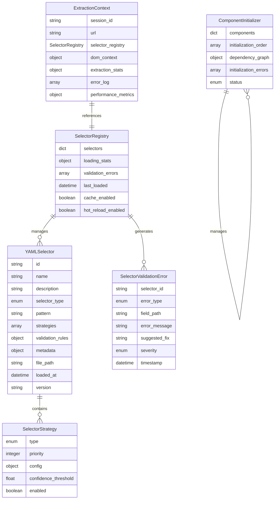
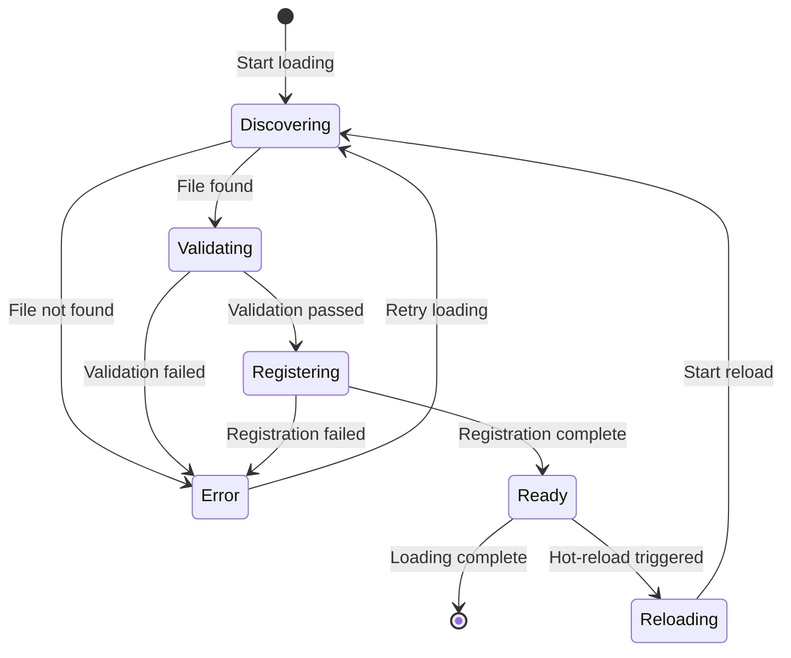
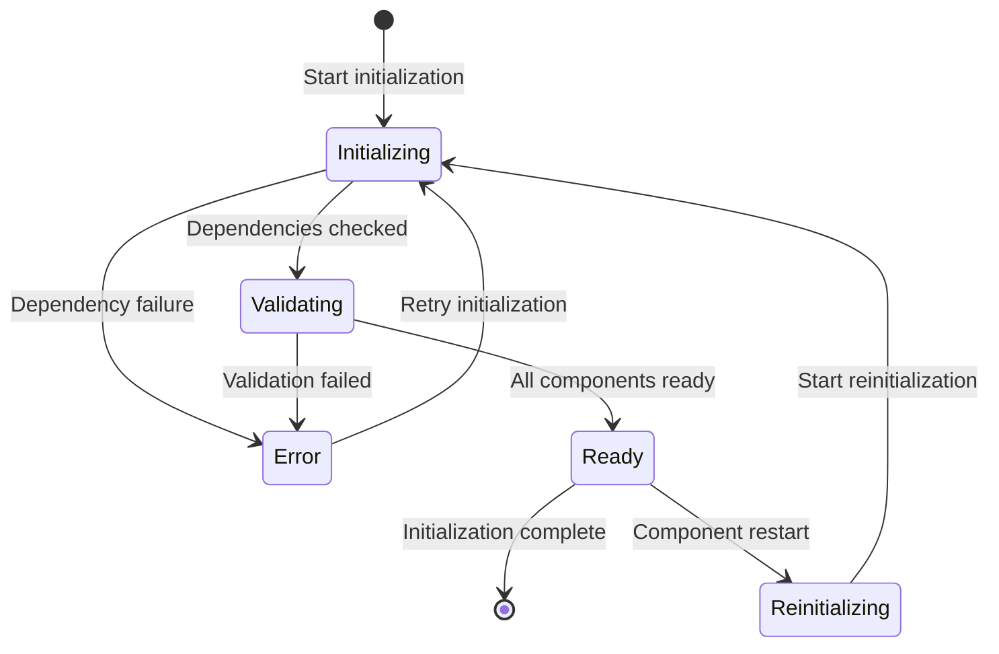

# Data Model: Wikipedia Extractor Integration Fix

**Feature**: 016-wikipedia-extractor-fix  
**Date**: 2026-01-29  
**Purpose**: Entity definitions and data structures for YAML selector loading system

## Overview

This document defines the core entities and data structures required for implementing YAML selector loading in the Wikipedia extractor integration. The data model follows the existing architecture patterns and maintains backward compatibility.

## Core Entities

### YAMLSelector

Represents a selector configuration loaded from a YAML file with validation metadata.

**Attributes**:
- `id` (string): Unique identifier for the selector (derived from filename)
- `name` (string): Human-readable name for the selector
- `description` (string): Optional description of selector purpose
- `selector_type` (enum): Type of selector (css, xpath, text, attribute)
- `pattern` (string): The actual selector pattern
- `strategies` (array): Array of selector resolution strategies
- `validation_rules` (object): Validation rules for this selector
- `metadata` (object): Additional metadata (confidence thresholds, etc.)
- `file_path` (string): Path to the source YAML file
- `loaded_at` (datetime): Timestamp when selector was loaded
- `version` (string): Schema version for compatibility

**Validation Rules**:
- `id` must be unique across all selectors
- `selector_type` must be one of: css, xpath, text, attribute
- `pattern` must be valid for the specified selector type
- `strategies` array must contain at least one valid strategy
- `file_path` must exist and be readable

### SelectorStrategy

Represents a single selector resolution strategy with configuration.

**Attributes**:
- `type` (enum): Strategy type (text_anchor, attribute_match, dom_relationship, role_based)
- `priority` (integer): Priority order for strategy execution (1 = highest)
- `config` (object): Strategy-specific configuration
- `confidence_threshold` (float): Minimum confidence score for this strategy
- `enabled` (boolean): Whether this strategy is active

**Strategy-Specific Configurations**:

**Text Anchor Strategy**:
- `anchor_text` (string): Text to anchor the selector
- `case_sensitive` (boolean): Whether matching is case sensitive
- `partial_match` (boolean): Allow partial text matches

**Attribute Match Strategy**:
- `attribute` (string): HTML attribute to match
- `value_pattern` (string): Regex pattern for attribute value
- `exact_match` (boolean): Whether to require exact value match

**DOM Relationship Strategy**:
- `relationship_type` (enum): parent, child, sibling, ancestor
- `target_selector` (string): Target selector for relationship
- `max_depth` (integer): Maximum depth to search

**Role-Based Strategy**:
- `role` (string): ARIA role or semantic role
- `required_attributes` (array): Required attributes for this role
- `excluded_attributes` (array): Attributes to exclude

### SelectorRegistry

Manages loading, validation, and registration of YAML selectors.

**Attributes**:
- `selectors` (dict): Dictionary of loaded selectors keyed by ID
- `loading_stats` (object): Statistics about selector loading
- `validation_errors` (array): Array of validation errors encountered
- `last_loaded` (datetime): Timestamp of last selector loading
- `cache_enabled` (boolean): Whether selector caching is enabled
- `hot_reload_enabled` (boolean): Whether hot-reloading is enabled

**Methods**:
- `load_selectors_from_directory(path)`: Load all YAML selectors from directory
- `load_selector_from_file(file_path)`: Load single selector from file
- `validate_selector(selector)`: Validate selector structure and rules
- `register_selector(selector)`: Register selector in registry
- `get_selector(id)`: Retrieve selector by ID
- `reload_selectors()`: Reload all selectors (for hot-reloading)
- `get_statistics()`: Get loading and usage statistics

### SelectorValidationError

Represents a validation error for a selector configuration.

**Attributes**:
- `selector_id` (string): ID of the selector with validation error
- `error_type` (enum): syntax_error, structure_error, validation_error
- `field_path` (string): Path to the field with error (dot notation)
- `error_message` (string): Human-readable error message
- `suggested_fix` (string): Suggested fix for the error
- `severity` (enum): error, warning, info
- `timestamp` (datetime): When the error was detected

### ExtractionContext

Contains state for current extraction operation including loaded selectors.

**Attributes**:
- `session_id` (string): Unique identifier for extraction session
- `url` (string): URL being extracted
- `selector_registry` (SelectorRegistry): Reference to selector registry
- `dom_context` (object): DOM context for current extraction
- `extraction_stats` (object): Statistics for current extraction
- `error_log` (array): Array of errors encountered during extraction
- `performance_metrics` (object): Performance timing data

### ComponentInitializer

Handles initialization of modular components with proper context.

**Attributes**:
- `components` (dict): Dictionary of initialized components
- `initialization_order` (array): Order of component initialization
- `dependency_graph` (object): Component dependency relationships
- `initialization_errors` (array): Errors encountered during initialization
- `status` (enum): initializing, ready, error)

**Methods**:
- `initialize_component(component_name, context)`: Initialize single component
- `initialize_all_components(context)`: Initialize all components in order
- `validate_dependencies()`: Validate component dependencies
- `get_component_status(component_name)`: Get initialization status
- `handle_initialization_error(error)`: Handle initialization errors

## Data Relationships

## State Transitions

### Selector Loading State Machine

### Component Initialization State Machine

## Validation Rules

### YAML Selector Validation

**Required Fields**:
- `id`: Must be unique and non-empty
- `selector_type`: Must be valid enum value
- `pattern`: Must be non-empty string
- `strategies`: Must contain at least one strategy

**Field Validation**:
- `priority`: Must be positive integer
- `confidence_threshold`: Must be between 0.0 and 1.0
- `file_path`: Must exist and be readable YAML file
- `version`: Must follow semantic versioning

**Cross-Field Validation**:
- Strategy priorities must be unique within selector
- All strategy configurations must match strategy type
- Selector pattern must be valid for selector type

### Component Context Validation

**Required Parameters**:
- `config_manager`: Must be provided for component initialization
- `logger`: Must be provided for structured logging
- `performance_monitor`: Must be provided for metrics

**Dependency Validation**:
- All dependencies must be available before initialization
- Circular dependencies must be detected and prevented
- Optional dependencies must be clearly marked

## Performance Considerations

### Memory Usage

- **Selector Cache**: Estimated 1-5KB per selector (including strategies)
- **Registry Overhead**: ~100KB base overhead for registry management
- **Component Context**: ~50KB per component initialization context

### Loading Performance

- **File Discovery**: ~10ms per directory (filesystem dependent)
- **YAML Parsing**: ~5ms per selector file (average size)
- **Validation**: ~2ms per selector (simple validation rules)
- **Registration**: ~1ms per selector (hash table insertion)

### Caching Strategy

- **In-Memory Cache**: Cache loaded selectors for session duration
- **Validation Cache**: Cache validation results for unchanged files
- **File Watching**: Monitor file changes for hot-reloading (development only)

## Error Handling

### Error Categories

**File System Errors**:
- File not found
- Permission denied
- Invalid YAML syntax
- Encoding issues

**Validation Errors**:
- Invalid selector type
- Malformed selector pattern
- Invalid strategy configuration
- Missing required fields

**Runtime Errors**:
- Selector registration conflicts
- Component initialization failures
- Memory allocation failures
- Concurrent access issues

### Error Recovery

**Automatic Recovery**:
- Retry failed file operations (exponential backoff)
- Skip invalid selectors with warnings
- Fallback to basic extraction for critical failures
- Cache validation results to avoid repeated failures

**Manual Recovery**:
- Clear error logs and retry
- Reload individual selector files
- Restart component initialization
- Reset selector registry

## Security Considerations

### YAML Security

- Use `yaml.safe_load()` to prevent code injection
- Validate file paths to prevent directory traversal
- Limit file size to prevent DoS attacks
- Sanitize error messages to prevent information leakage

### Access Control

- Validate file permissions before loading
- Restrict selector file locations to approved directories
- Implement rate limiting for hot-reloading operations
- Audit selector loading operations

## Integration Points

### Existing Selector Engine Integration

**Registration Interface**:
- Extend existing `SelectorEngine.register_selector()` method
- Maintain backward compatibility with existing selector registration
- Add new `SelectorEngine.load_yaml_selectors()` method
- Integrate with existing performance monitoring

**Validation Integration**:
- Extend existing validation framework for YAML selectors
- Reuse existing error handling patterns
- Integrate with existing logging infrastructure
- Maintain existing confidence scoring mechanisms

### Component System Integration

**Context Integration**:
- Extend existing `ComponentContext` initialization
- Maintain existing dependency injection patterns
- Add new component types for YAML loading
- Integrate with existing lifecycle management

**Monitoring Integration**:
- Extend existing performance monitoring
- Add new metrics for selector loading
- Integrate with existing health checks
- Maintain existing alerting patterns

## Future Extensibility

### Selector Type Extensions

- Support for new selector types (e.g., ML-based selectors)
- Custom strategy types for specific use cases
- Plugin architecture for selector extensions
- Dynamic selector type registration

### Performance Optimizations

- Distributed selector loading for large-scale deployments
- Selector precompilation for improved performance
- Adaptive caching strategies based on usage patterns
- Background loading and validation

### Advanced Features

- Selector versioning and migration
- A/B testing for selector strategies
- Machine learning for selector optimization
- Real-time selector performance analytics
